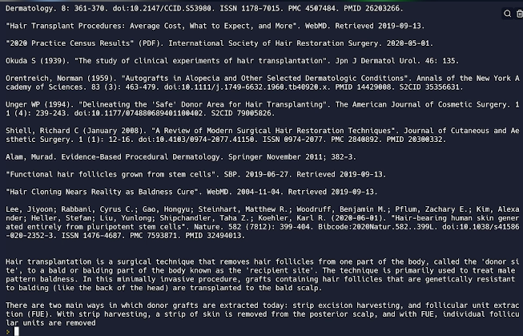

# 👉 Day 97 Challenge

Today's challenge is to combine scraping with the openAI summariser.

Your program should:

1. Scrape an article on a topic of your choice from Wikipedia. We recommend [this one](https://en.wikipedia.org/wiki/Hair_loss).
2. Send it to openAI.
3. Have it summarized in no more than 3 paragraphs.
4. Output the summary with the Wikipedia references at the bottom.

Example:

 
 💡 Hints 

  
- Get the Wiki URL as input `url = input("Paste wiki URL > ")`
- Beautiful soup can find Wiki references for you too `refs = soup.find_all("ol", {"class": "references"})`

